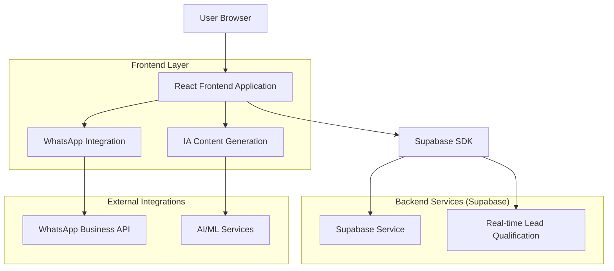
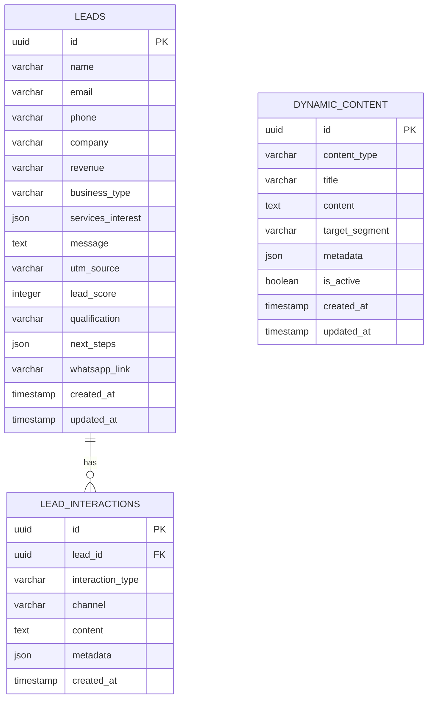

# Documento de Arquitetura Técnica - MMT Modelo Marketing Top

## 1. Arquitetura Design



## 2. Descrição das Tecnologias

* Frontend: React\@18 + TypeScript + TailwindCSS\@3 + Vite + Framer Motion (animações)

* Backend: Supabase (Database, Auth, Real-time)

* Integrações: WhatsApp Business API + OpenAI/Claude (IA Content)

* Formulários: React Hook Form + Zod (validação)

* Ícones: Lucide React

* Deployment: Vercel/Netlify

## 3. Definições de Rotas

| Rota           | Propósito                                                                             |
| -------------- | ------------------------------------------------------------------------------------- |
| /              | Landing page completa da MMT com todas as seções (Hero, Services, Segmentation, etc.) |
| /#hero         | Seção Hero - 'Transforme sua presença digital com IA de verdade'                      |
| /#services     | Seção de Serviços Inteligentes (Sites IA, Agentes Multicanal, Automação)              |
| /#about        | Seção Value Proposition (Missão, Visão, Valores da MMT)                               |
| /#testimonials | Seção de Depoimentos e Casos de Sucesso                                               |
| /#contact      | Seção do Formulário Inteligente de Contato                                            |
| /admin         | Área administrativa para gestão de leads e conteúdo (futuro)                          |

## 4. Definições de API

### 4.1 Core API

Submissão de formulário inteligente com pré-qualificação

```
POST /api/leads
```

Request:

| Nome do Parâmetro  | Tipo do Parâmetro | Obrigatório | Descrição                                                    |
| ------------------ | ----------------- | ----------- | ------------------------------------------------------------ |
| name               | string            | true        | Nome completo do lead                                        |
| email              | string            | true        | Email válido do lead                                         |
| phone              | string            | true        | Telefone de contato                                          |
| company            | string            | false       | Nome da empresa                                              |
| revenue            | string            | false       | Faturamento mensal (R$ 40k+, R$ 100k+, etc.)                 |
| business\_type     | string            | true        | Tipo de negócio (empresa, empreendedor, influenciador)       |
| services\_interest | array             | true        | Serviços de interesse (sites\_ia, agentes\_multicanal, etc.) |
| message            | string            | true        | Mensagem personalizada                                       |
| utm\_source        | string            | false       | Origem do tráfego                                            |

Response:

| Nome do Parâmetro | Tipo do Parâmetro | Descrição                               |
| ----------------- | ----------------- | --------------------------------------- |
| success           | boolean           | Status da operação                      |
| lead\_score       | number            | Pontuação de qualificação (0-100)       |
| qualification     | string            | Nível de qualificação (hot, warm, cold) |
| next\_steps       | array             | Próximos passos sugeridos               |
| whatsapp\_link    | string            | Link direto para WhatsApp com contexto  |
| id                | string            | ID do lead criado                       |

### 4.2 IA Content API

Geração de conteúdo dinâmico

```
GET /api/content/dynamic
```

Response:

| Nome do Parâmetro | Tipo do Parâmetro | Descrição                                      |
| ----------------- | ----------------- | ---------------------------------------------- |
| articles          | array             | Artigos gerados por IA sobre marketing digital |
| tips              | array             | Dicas personalizadas por segmento              |
| case\_studies     | array             | Casos de sucesso atualizados                   |

Exemplo Request:

```json
{
  "name": "Maria Entrepreneur",
  "email": "maria@startup.com",
  "phone": "11987654321",
  "company": "Startup Inovadora",
  "revenue": "R$ 50k-100k",
  "business_type": "empreendedor",
  "services_interest": ["sites_ia", "agentes_multicanal"],
  "message": "Preciso de uma solução completa para minha startup"
}
```

## 6. Modelo de Dados

### 6.1 Definição do Modelo de Dados



### 6.2 Linguagem de Definição de Dados

Tabela de Leads Qualificados (leads)

```sql
-- Criar tabela de leads
CREATE TABLE leads (
    id UUID PRIMARY KEY DEFAULT gen_random_uuid(),
    name VARCHAR(255) NOT NULL,
    email VARCHAR(255) NOT NULL,
    phone VARCHAR(20) NOT NULL,
    company VARCHAR(255),
    revenue VARCHAR(50),
    business_type VARCHAR(50) NOT NULL CHECK (business_type IN ('empresa', 'empreendedor', 'influenciador')),
    services_interest JSONB NOT NULL,
    message TEXT NOT NULL,
    utm_source VARCHAR(100),
    lead_score INTEGER DEFAULT 0 CHECK (lead_score >= 0 AND lead_score <= 100),
    qualification VARCHAR(20) DEFAULT 'cold' CHECK (qualification IN ('hot', 'warm', 'cold')),
    next_steps JSONB,
    whatsapp_link TEXT,
    created_at TIMESTAMP WITH TIME ZONE DEFAULT NOW(),
    updated_at TIMESTAMP WITH TIME ZONE DEFAULT NOW()
);

-- Criar tabela de conteúdo dinâmico
CREATE TABLE dynamic_content (
    id UUID PRIMARY KEY DEFAULT gen_random_uuid(),
    content_type VARCHAR(50) NOT NULL CHECK (content_type IN ('article', 'tip', 'case_study', 'news')),
    title VARCHAR(255) NOT NULL,
    content TEXT NOT NULL,
    target_segment VARCHAR(50) CHECK (target_segment IN ('empresa', 'empreendedor', 'influenciador', 'all')),
    metadata JSONB,
    is_active BOOLEAN DEFAULT true,
    created_at TIMESTAMP WITH TIME ZONE DEFAULT NOW(),
    updated_at TIMESTAMP WITH TIME ZONE DEFAULT NOW()
);

-- Criar tabela de interações com leads
CREATE TABLE lead_interactions (
    id UUID PRIMARY KEY DEFAULT gen_random_uuid(),
    lead_id UUID REFERENCES leads(id) ON DELETE CASCADE,
    interaction_type VARCHAR(50) NOT NULL CHECK (interaction_type IN ('form_submit', 'whatsapp_click', 'email_open', 'page_view')),
    channel VARCHAR(50) NOT NULL CHECK (channel IN ('website', 'whatsapp', 'email', 'social')),
    content TEXT,
    metadata JSONB,
    created_at TIMESTAMP WITH TIME ZONE DEFAULT NOW()
);

-- Criar índices
CREATE INDEX idx_leads_email ON leads(email);
CREATE INDEX idx_leads_business_type ON leads(business_type);
CREATE INDEX idx_leads_qualification ON leads(qualification);
CREATE INDEX idx_leads_created_at ON leads(created_at DESC);
CREATE INDEX idx_dynamic_content_type ON dynamic_content(content_type);
CREATE INDEX idx_dynamic_content_segment ON dynamic_content(target_segment);
CREATE INDEX idx_lead_interactions_lead_id ON lead_interactions(lead_id);
CREATE INDEX idx_lead_interactions_type ON lead_interactions(interaction_type);

-- Configurar RLS (Row Level Security)
ALTER TABLE leads ENABLE ROW LEVEL SECURITY;
ALTER TABLE dynamic_content ENABLE ROW LEVEL SECURITY;
ALTER TABLE lead_interactions ENABLE ROW LEVEL SECURITY;

-- Políticas para leads
CREATE POLICY "Allow anonymous insert leads" ON leads
    FOR INSERT TO anon
    WITH CHECK (true);

CREATE POLICY "Allow authenticated access leads" ON leads
    FOR ALL TO authenticated
    USING (true)
    WITH CHECK (true);

-- Políticas para conteúdo dinâmico
CREATE POLICY "Allow anonymous read dynamic_content" ON dynamic_content
    FOR SELECT TO anon
    USING (is_active = true);

CREATE POLICY "Allow authenticated access dynamic_content" ON dynamic_content
    FOR ALL TO authenticated
    USING (true)
    WITH CHECK (true);

-- Políticas para interações
CREATE POLICY "Allow anonymous insert interactions" ON lead_interactions
    FOR INSERT TO anon
    WITH CHECK (true);

CREATE POLICY "Allow authenticated access interactions" ON lead_interactions
    FOR ALL TO authenticated
    USING (true)
    WITH CHECK (true);

-- Dados iniciais de conteúdo dinâmico
INSERT INTO dynamic_content (content_type, title, content, target_segment, metadata) VALUES
('article', 'Como a IA está Revolucionando o Marketing Digital', 'A inteligência artificial está transformando a forma como empresas se conectam com seus clientes...', 'all', '{"tags": ["IA", "Marketing", "Inovação"]}'),
('tip', 'Dica para Empresas: Automatize seu Atendimento', 'Implemente chatbots inteligentes para atender seus clientes 24/7...', 'empresa', '{"difficulty": "beginner"}'),
('tip', 'Empreendedores: Maximize sua Presença Digital', 'Use ferramentas de IA para criar conteúdo personalizado...', 'empreendedor', '{"difficulty": "intermediate"}'),
('case_study', 'Caso de Sucesso: 300% de Aumento em Leads', 'Veja como nossa cliente aumentou drasticamente sua geração de leads...', 'all', '{"industry": "e-commerce", "results": "300% increase"}');
```

**Variáveis de Ambiente (.env)**

```env
VITE_SUPABASE_URL=your_supabase_project_url
VITE_SUPABASE_ANON_KEY=your_supabase_anon_key
VITE_WHATSAPP_NUMBER=5566996823277
```

**Estrutura de Componentes React**

```
src/
├── components/
│   ├── Header.tsx
│   ├── HeroSection.tsx
│   ├── ContactForm.tsx
│   ├── Footer.tsx
│   └── WhatsAppButton.tsx
├── lib/
│   └── supabase.ts
├── types/
│   └── index.ts
├── App.tsx
└── main.tsx
```

**Tipos TypeScript**

```typescript
export interface ContactFormData {
  name: string;
  email: string;
  phone: string;
  message: string;
}

export interface ContactResponse {
  success: boolean;
  data?: ContactFormData;
  error?: string;
}
```

