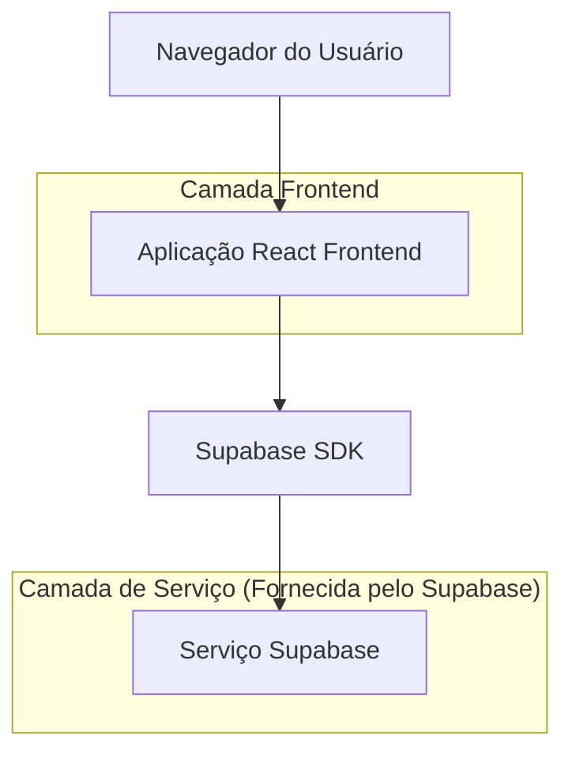
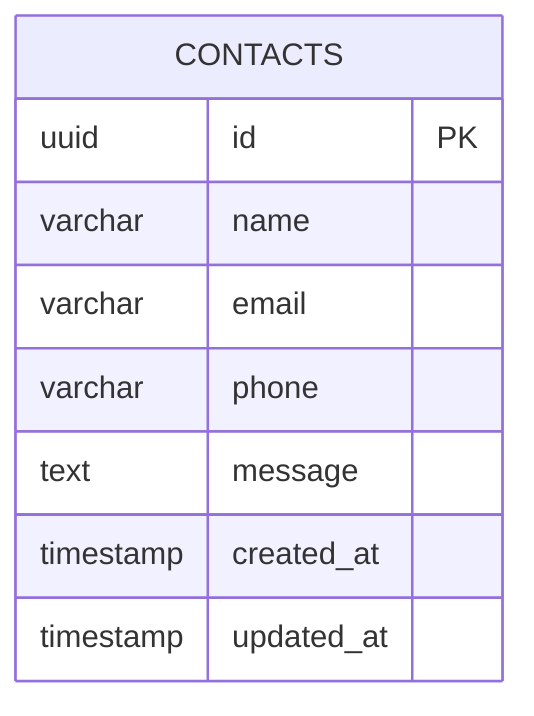

# Documento de Arquitetura Técnica - Landing Page Agência Modelo Marketing

## 1. Design da Arquitetura



## 2. Descrição da Tecnologia

- Frontend: React@18 + TypeScript + Tailwind CSS@3 + Vite
- Backend: Supabase (PostgreSQL + Auth + Storage)
- Bibliotecas adicionais: @supabase/supabase-js, react-hook-form, lucide-react

## 3. Definições de Rotas

| Rota | Propósito |
|------|----------|
| / | Página principal da landing page com todas as seções |

## 4. Definições de API

### 4.1 API Principal

Integração com formulário de contato via Supabase

**Inserção de contato**
```typescript
// Supabase insert operation
const { data, error } = await supabase
  .from('contacts')
  .insert(contactData)
```

**Parâmetros de Entrada:**
| Nome do Parâmetro | Tipo | Obrigatório | Descrição |
|-------------------|------|-------------|----------|
| name | string | true | Nome completo do contato |
| email | string | true | Email válido do contato |
| phone | string | true | Telefone no formato brasileiro |
| message | string | true | Mensagem do contato |

**Resposta:**
| Nome do Parâmetro | Tipo | Descrição |
|-------------------|------|----------|
| success | boolean | Status da operação |
| data | object | Dados inseridos (se sucesso) |
| error | object | Detalhes do erro (se falha) |

**Exemplo de Payload:**
```json
{
  "name": "João Silva",
  "email": "joao@exemplo.com",
  "phone": "(11) 99999-9999",
  "message": "Gostaria de saber mais sobre os serviços de IA"
}
```

## 5. Modelo de Dados

### 5.1 Definição do Modelo de Dados



### 5.2 Linguagem de Definição de Dados

**Tabela de Contatos (contacts)**
```sql
-- Criar tabela
CREATE TABLE contacts (
    id UUID PRIMARY KEY DEFAULT gen_random_uuid(),
    name VARCHAR(100) NOT NULL,
    email VARCHAR(255) NOT NULL,
    phone VARCHAR(20) NOT NULL,
    message TEXT NOT NULL,
    created_at TIMESTAMP WITH TIME ZONE DEFAULT NOW(),
    updated_at TIMESTAMP WITH TIME ZONE DEFAULT NOW()
);

-- Criar índices
CREATE INDEX idx_contacts_email ON contacts(email);
CREATE INDEX idx_contacts_created_at ON contacts(created_at DESC);

-- Configurar RLS (Row Level Security)
ALTER TABLE contacts ENABLE ROW LEVEL SECURITY;

-- Política para inserção (permitir inserções anônimas)
CREATE POLICY "Allow anonymous inserts" ON contacts
    FOR INSERT
    TO anon
    WITH CHECK (true);

-- Política para leitura (apenas usuários autenticados)
CREATE POLICY "Allow authenticated reads" ON contacts
    FOR SELECT
    TO authenticated
    USING (true);

-- Conceder permissões
GRANT INSERT ON contacts TO anon;
GRANT SELECT ON contacts TO authenticated;
```

**Variáveis de Ambiente (.env)**
```env
VITE_SUPABASE_URL=your_supabase_project_url
VITE_SUPABASE_ANON_KEY=your_supabase_anon_key
VITE_WHATSAPP_NUMBER=5511999999999
```

**Estrutura de Componentes React**
```
src/
├── components/
│   ├── Header.tsx
│   ├── HeroSection.tsx
│   ├── ContactForm.tsx
│   ├── Footer.tsx
│   └── WhatsAppButton.tsx
├── lib/
│   └── supabase.ts
├── types/
│   └── index.ts
├── App.tsx
└── main.tsx
```

**Tipos TypeScript**
```typescript
export interface ContactFormData {
  name: string;
  email: string;
  phone: string;
  message: string;
}

export interface ContactResponse {
  success: boolean;
  data?: ContactFormData;
  error?: string;
}
```