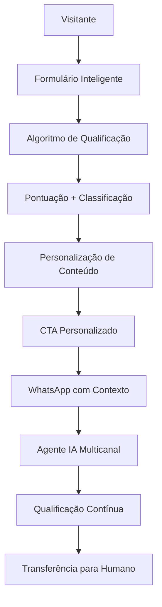

# Funcionalidades de IA - MMT Modelo Marketing Top

## 1. Visão Geral das Funcionalidades de IA

A MMT utiliza inteligência artificial em múltiplas camadas para otimizar a experiência do usuário, qualificar leads automaticamente e gerar conteúdo dinâmico personalizado.

## 2. Formulário Inteligente de Qualificação

### 2.1 Algoritmo de Pontuação

**Critérios de Pontuação (0-100 pontos):**
- Faturamento mensal:
  - R$ 40k-100k: 20 pontos
  - R$ 100k-500k: 35 pontos
  - R$ 500k+: 50 pontos
- Tipo de negócio:
  - Influenciador: 15 pontos
  - Empreendedor: 25 pontos
  - Empresa: 35 pontos
- Serviços de interesse:
  - 1 serviço: 10 pontos
  - 2-3 serviços: 20 pontos
  - 4+ serviços: 30 pontos
- Qualidade da mensagem (análise de texto): 0-15 pontos

### 2.2 Classificação de Leads

- **Hot Lead (80-100 pontos)**: Empresa com faturamento alto, interesse em múltiplos serviços
- **Warm Lead (50-79 pontos)**: Empreendedor com bom faturamento, interesse específico
- **Cold Lead (0-49 pontos)**: Perfil inicial, necessita nutrição

## 3. Agente de Comunicação IA Multicanal

### 3.1 Funcionalidades do Chatbot

**Capacidades Principais:**
- Atendimento 24/7 em português brasileiro
- Qualificação automática de leads
- Agendamento de reuniões
- Geração de orçamentos preliminares
- Transferência inteligente para humanos
- Manutenção de contexto entre canais (site → WhatsApp)

### 3.2 Integração WhatsApp Business

**Fluxo de Atendimento:**
1. Lead clica no botão WhatsApp com contexto pré-carregado
2. Mensagem inicial personalizada baseada na qualificação
3. Agente IA continua a conversa com histórico completo
4. Escalação automática para humano quando necessário

## 4. Geração de Conteúdo Dinâmico

### 4.1 Tipos de Conteúdo Gerado

**Artigos Automatizados:**
- Tendências em marketing digital
- Casos de uso de IA em negócios
- Dicas de otimização de conversão
- Análises de mercado

**Conteúdo Segmentado:**
- Empresas: Foco em ROI e escalabilidade
- Empreendedores: Crescimento e eficiência
- Influenciadores: Engajamento e monetização

### 4.2 Personalização por Segmento

**Algoritmo de Personalização:**
```
SE visitante = "empresa" ENTÃO
  Mostrar: casos B2B, ROI, escalabilidade
SE visitante = "empreendedor" ENTÃO
  Mostrar: growth hacks, automação, custos
SE visitante = "influenciador" ENTÃO
  Mostrar: engagement, monetização, personal branding
```

## 5. SEO Automatizado com IA

### 5.1 Otimização Automática

**Meta Tags Dinâmicas:**
- Títulos otimizados por página/segmento
- Descrições personalizadas por tipo de visitante
- Keywords automáticas baseadas em tendências

**Estrutura de Dados:**
- Schema.org para serviços
- FAQ estruturado
- Breadcrumbs automáticos

### 5.2 Análise de Performance

**Métricas Monitoradas:**
- Taxa de conversão por segmento
- Tempo de permanência por seção
- Origem de tráfego mais qualificado
- Performance de CTAs por tipo de lead

## 6. Implementação Técnica

### 6.1 Stack de IA

**APIs Utilizadas:**
- OpenAI GPT-4 para geração de conteúdo
- Claude 3 para análise de sentimento
- WhatsApp Business API para integração
- Google Analytics 4 para tracking inteligente

### 6.2 Fluxo de Dados



## 7. KPIs e Métricas de IA

### 7.1 Métricas de Performance

**Qualificação de Leads:**
- Precisão do algoritmo de pontuação: >85%
- Taxa de conversão Hot Leads: >40%
- Taxa de conversão Warm Leads: >20%
- Taxa de conversão Cold Leads: >5%

**Conteúdo Dinâmico:**
- Engagement por segmento: +30% vs conteúdo estático
- Tempo de permanência: +45%
- Taxa de clique em CTAs: +25%

### 7.2 Otimização Contínua

**A/B Testing Automatizado:**
- Títulos de seções
- CTAs por segmento
- Fluxos de qualificação
- Mensagens do chatbot

**Machine Learning:**
- Aprendizado contínuo dos padrões de conversão
- Ajuste automático de pontuação de leads
- Otimização de timing para follow-up
- Personalização crescente baseada em dados

## 8. Roadmap de Funcionalidades

### 8.1 Fase 1 (Atual)
- Formulário inteligente básico
- Chatbot com regras fixas
- Conteúdo dinâmico simples

### 8.2 Fase 2 (3-6 meses)
- Machine learning para qualificação
- Chatbot com processamento de linguagem natural
- Personalização avançada por comportamento

### 8.3 Fase 3 (6-12 meses)
- Predição de intenção de compra
- Automação completa de nurturing
- Integração com CRM inteligente
- Análise preditiva de churn