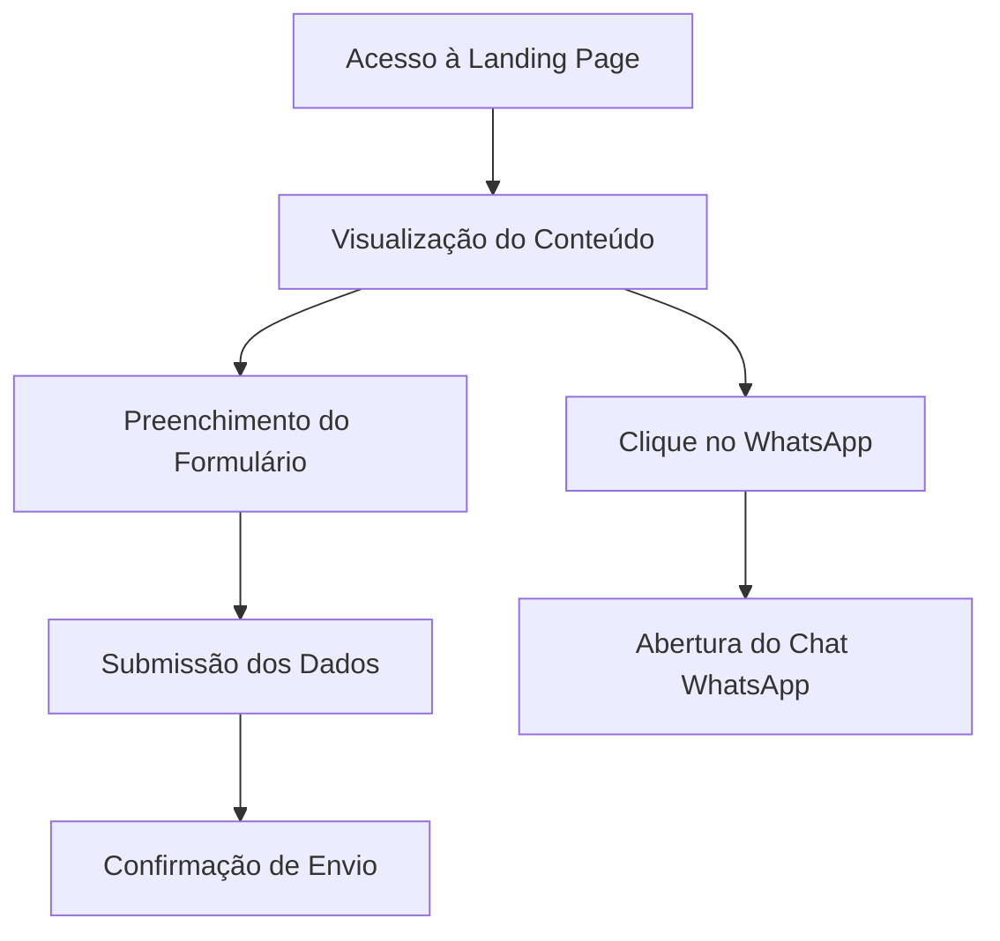

# Documento de Requisitos do Produto - Landing Page Agência Modelo Marketing

## 1. Visão Geral do Produto

Landing page "em breve" de página única com design moderno e profissional para estabelecer presença online inicial da Agência Modelo Marketing, capturar leads qualificados e comunicar proposta de valor inovadora focada em IA.

A agência é especializada em sistemas, sites e aplicações impulsionadas por Inteligência Artificial, transmitindo velocidade, eficiência e tecnologia de ponta para acelerar negócios de PMEs.

O produto visa atingir o mercado de pequenas e médias empresas com faturamento mensal acima de R$ 40.000, oferecendo soluções digitais avançadas.

## 2. Funcionalidades Principais

### 2.1 Papéis de Usuário

| Papel | Método de Registro | Permissões Principais |
|-------|-------------------|----------------------|
| Visitante | Acesso direto | Visualizar conteúdo, preencher formulário de contato, acessar WhatsApp |

### 2.2 Módulo de Funcionalidades

Nossa landing page consiste nas seguintes páginas principais:
1. **Página Principal**: seção hero, navegação, formulário de contato, rodapé com redes sociais, botão flutuante WhatsApp.

### 2.3 Detalhes das Páginas

| Nome da Página | Nome do Módulo | Descrição da Funcionalidade |
|----------------|----------------|-----------------------------|
| Página Principal | Header | Exibir logotipo da "Agência Modelo Marketing" com design responsivo |
| Página Principal | Seção Hero | Apresentar headline principal, subheadline sobre IA, imagem de fundo com overlay |
| Página Principal | Formulário de Contato | Capturar dados (nome, email, telefone, mensagem), validar campos obrigatórios, integrar com Supabase, exibir mensagens de sucesso/erro |
| Página Principal | Rodapé | Mostrar links de redes sociais (Instagram, Facebook, Twitter), copyright 2025 |
| Página Principal | Botão WhatsApp Flutuante | Botão fixo no canto inferior direito, abrir conversa WhatsApp com número placeholder |

## 3. Processo Principal

Fluxo principal do usuário:
1. Visitante acessa a landing page
2. Visualiza informações sobre a agência e serviços de IA
3. Preenche formulário de contato com dados pessoais
4. Submete formulário (dados salvos no Supabase)
5. Recebe confirmação de envio
6. Opcionalmente, clica no botão WhatsApp para contato direto

## 4. Design da Interface do Usuário

### 4.1 Estilo de Design

- **Cores primárias e secundárias**: Tiffany Blue (#A0E7E5), Mint (#B4F8C8), Hot Pink (#FFAEBC), Yellow (#FBE7C6)
- **Estilo dos botões**: Arredondados com hover effects e transições suaves
- **Fonte e tamanhos**: Montserrat/Poppins para títulos (24px-48px), Lato/Raleway para corpo (16px-18px)
- **Estilo de layout**: Design limpo baseado em cards, navegação superior fixa
- **Ícones e emojis**: Ícones minimalistas para redes sociais, ícone WhatsApp em estilo flat

### 4.2 Visão Geral do Design das Páginas

| Nome da Página | Nome do Módulo | Elementos da UI |
|----------------|----------------|----------------|
| Página Principal | Header | Fundo branco, logo com ícone geométrico rosa, tipografia bold escura |
| Página Principal | Seção Hero | Fundo com imagem e overlay escuro, texto branco centralizado, destaque em cores da marca |
| Página Principal | Formulário | Fundo amarelo claro, campos com fundo azul tiffany translúcido, botão rosa com hover |
| Página Principal | Rodapé | Fundo claro, ícones de redes sociais com hover rosa, texto cinza |
| Página Principal | WhatsApp | Botão circular verde menta, ícone branco, sombra sutil, animação de escala no hover |

### 4.3 Responsividade

Design mobile-first com adaptação para tablet e desktop. Otimização para interação touch em dispositivos móveis, com breakpoints em 768px (tablet) e 1024px (desktop).