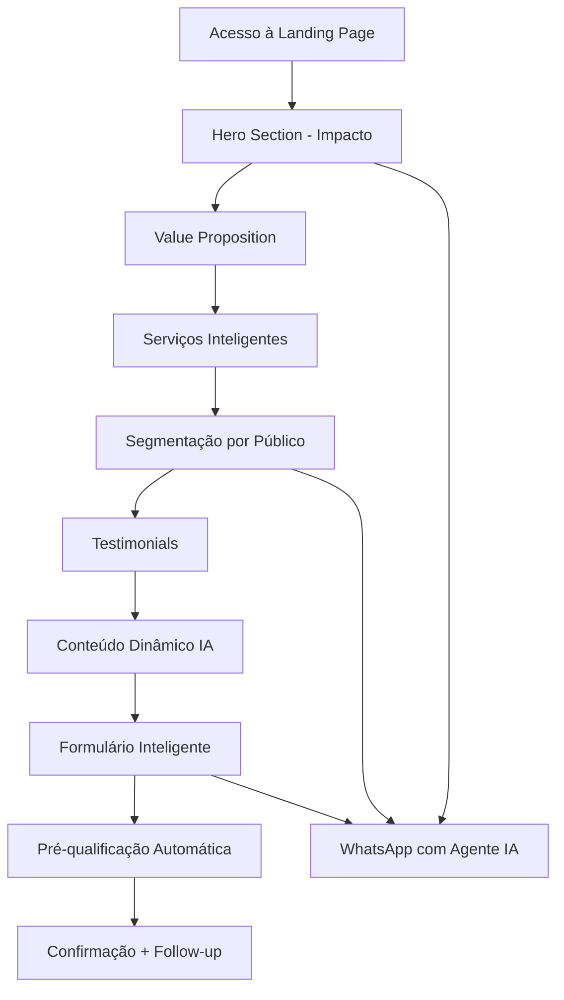

# Documento de Requisitos do Produto - Landing Page Agência Modelo Marketing

## 1. Product Overview

Uma landing page completa e inteligente para a MMT Modelo Marketing Top, agência especializada em soluções com Inteligência Artificial. A plataforma visa consolidar uma empresa que entrega sistemas e aplicações de forma rápida e eficiente, tornando-se referência no uso de IA e na entrega de produtos funcionais.
- O projeto estabelece presença online estratégica para gerar leads qualificados e comunicar a proposta de valor para PMEs, empreendedores e influenciadores digitais com faturamento acima de R$ 40 mil/mês.
- Metas ambiciosas: Landing Page no ar em 30 dias, mínimo de 300 leads qualificados nos primeiros 6 meses e efetivação de 12 novos clientes por ano.

## 2. Funcionalidades Principais

### 2.1 Papéis de Usuário

| Papel | Método de Registro | Permissões Principais |
|-------|-------------------|----------------------|
| Visitante | Acesso direto | Visualizar conteúdo, preencher formulário de contato, acessar WhatsApp |

### 2.2 Feature Module

Nossa landing page da MMT Modelo Marketing Top consiste nas seguintes seções principais:
1. **Header**: cabeçalho fixo com logo MMT, menu de navegação por âncoras, botão 'Fale com nosso agente IA'.
2. **Hero Section**: título impactante 'Transforme sua presença digital com IA de verdade', CTAs para WhatsApp e formulário, elemento visual de tecnologia.
3. **Value Proposition**: missão, visão, valores e diferenciais 'Por que escolher a MMT?'.
4. **Services**: serviços inteligentes (sites com IA, agentes multicanal, landing pages Instagram, automação IA).
5. **Segmentation**: blocos customizados por IA para cada público (Empresa, Empreendedor, Influenciador).
6. **Testimonials**: depoimentos de clientes e casos de sucesso otimizados por IA.
7. **Dynamic Content**: notícias e insights sobre marketing digital e IA gerados automaticamente.
8. **Lead Form**: formulário inteligente que se adapta em tempo real para pré-qualificação.
9. **WhatsApp CTA**: botão flutuante para contato com agente IA treinado.
10. **Footer**: contatos, redes sociais, termos de privacidade e área administrativa.

### 2.3 Detalhes das Páginas

| Nome da Seção | Nome do Módulo | Descrição da Funcionalidade |
|---------------|----------------|-----------------------------|  
| Header | Logo e Navegação | Cabeçalho fixo com logo MMT, menu de navegação por âncoras (Início, Serviços, Sobre, Contato) |
| Header | CTA Principal | Botão destacado 'Fale com nosso agente IA' ou 'Orçamento Rápido' |
| Hero Section | Título Impactante | 'Transforme sua presença digital com IA de verdade' com animações e elementos visuais |
| Hero Section | CTAs Duplos | Botões para WhatsApp e formulário, elemento visual de tecnologia e inovação |
| Value Proposition | Missão/Visão/Valores | Consolidar empresa que entrega sistemas rapidamente, referência em IA, compromisso com prazos |
| Services | Sites Personalizados | Desenvolvimento ágil com design responsivo otimizado por IA para performance e SEO |
| Services | Agentes IA Multicanal | Atendimento 24h em site, WhatsApp e Instagram com transferência para humanos |
| Services | Landing Pages Instagram | Soluções para link na bio com métricas e integração inteligente ao WhatsApp |
| Services | Automação com IA | Fluxos que qualificam leads, respondem dúvidas e acompanham cliente mantendo histórico |
| Segmentation | Público Empresa | Bloco customizado para PMEs com soluções corporativas e automação de processos |
| Segmentation | Público Empreendedor | Ofertas para empreendedores focadas em crescimento e presença digital |
| Segmentation | Público Influenciador | Soluções para influenciadores com foco em engajamento e monetização |
| Testimonials | Casos de Sucesso | Depoimentos de clientes, parceiros e resultados obtidos com textos otimizados por IA |
| Dynamic Content | Conteúdo Automático | Notícias, dicas e insights sobre marketing digital e IA gerados automaticamente |
| Lead Form | Formulário Inteligente | Formulário dinâmico que se adapta em tempo real para pré-qualificação automática dos leads |
| WhatsApp CTA | Contato Instantâneo | Botão flutuante para WhatsApp atendido por agente IA treinado |
| Footer | Informações Completas | Contatos, redes sociais, termos de privacidade, política de uso e área administrativa |

## 3. Processo Principal

Fluxo principal do usuário na MMT Modelo Marketing Top:
1. Visitante acessa a landing page e visualiza o header com navegação
2. Impactado pelo hero section 'Transforme sua presença digital com IA de verdade'
3. Explora a proposta de valor (missão, visão, valores da MMT)
4. Conhece os serviços inteligentes (sites com IA, agentes multicanal, automação)
5. Identifica-se com segmentação específica (Empresa, Empreendedor ou Influenciador)
6. Lê testimonials e casos de sucesso para validação social
7. Consome conteúdo dinâmico sobre marketing digital e IA
8. Preenche formulário inteligente que se adapta ao seu perfil
9. Recebe pré-qualificação automática e confirmação
10. Opcionalmente, inicia conversa com agente IA via WhatsApp

## 4. Design da Interface do Usuário

### 4.1 Estilo de Design

- **Cores primárias e secundárias**: 
  - Primary: #A0E7E5 (Tiffany Blue) - cor principal da marca
  - Secondary: #B4F8C8 (Mint) - cor de apoio e destaque
  - Accent: #FFAEBC (Hot Pink) - cor de ação e CTAs
  - Support: #FBE7C6 (Yellow) - cor de suporte e backgrounds
- **Estilo dos botões**: Modernos e arredondados com gradientes sutis, hover effects e micro-animações
- **Fonte e tamanhos**: Combinação de 2-3 fontes (Lato, Raleway, Poppins, Montserrat) - títulos 32px-56px, subtítulos 20px-28px, corpo 16px-18px
- **Estilo de layout**: Clean, moderno, organizado e profissional, focado na clareza e facilidade de contato
- **Ícones e emojis**: Ícones minimalistas de tecnologia e IA, elementos visuais que remetem à inovação

### 4.2 Visão Geral do Design das Páginas

| Nome da Seção | Nome do Módulo | Elementos da UI |
|---------------|----------------|----------------|
| Header | Logo MMT | Fundo branco/transparente, logo MMT com tipografia moderna, navegação horizontal limpa |
| Header | CTA Principal | Botão Hot Pink (#FFAEBC) 'Fale com nosso agente IA', hover com micro-animação |
| Hero Section | Título Impactante | Fundo com gradiente Tiffany Blue, tipografia bold 48px+, animações de entrada suaves |
| Hero Section | Elementos Visuais | Ilustrações de tecnologia/IA, partículas animadas, CTAs duplos com cores contrastantes |
| Value Proposition | Missão/Visão | Cards com fundo Mint (#B4F8C8), ícones de inovação, tipografia clara e profissional |
| Services | Serviços IA | Grid responsivo, cards com hover effects, ícones de tecnologia, gradientes sutis |
| Segmentation | Públicos | Blocos diferenciados por cores da paleta, personalização visual por tipo de cliente |
| Testimonials | Depoimentos | Cards com sombras suaves, fotos dos clientes, aspas estilizadas, fundo neutro |
| Dynamic Content | Conteúdo IA | Seção com fundo Yellow (#FBE7C6), cards de notícias, badges 'Gerado por IA' |
| Lead Form | Formulário Inteligente | Campos adaptativos, validação em tempo real, botão de envio com gradiente |
| WhatsApp CTA | Botão Flutuante | Botão circular Mint (#B4F8C8), ícone WhatsApp, sombra pronunciada, animação de pulso |
| Footer | Informações | Fundo escuro, links organizados em colunas, ícones de redes sociais com hover effects |

### 4.3 Responsividade

Design mobile-first com adaptação para tablet e desktop. Otimização para interação touch em dispositivos móveis, com breakpoints em 768px (tablet) e 1024px (desktop).